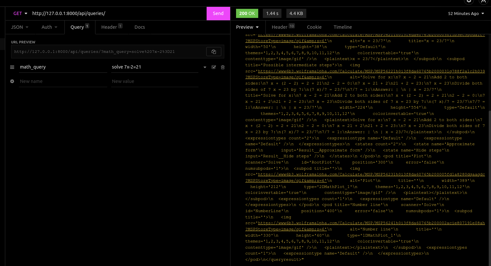

Copy code
# FoondaMate API

An REST API that integrates with Wolfram API to solve high school level mathematical equations.

## Technologies Used

- Python 3
- Django Rest Framework
- Wolfram API

## Installation

Instructions on how to install the project. This might include:

- System requirements
        
        Python's package manager: pipenv
- Installation instructions:

        git clone https://github.com/Princeigwe/foondamate_code_test.git

## Usage

Endpoint: 

        http://127.0.0.1:8000/api/queries/?{math_query}

- Command line usage:
        
        pipenv shell
        python manage.py runserver

- Example:

